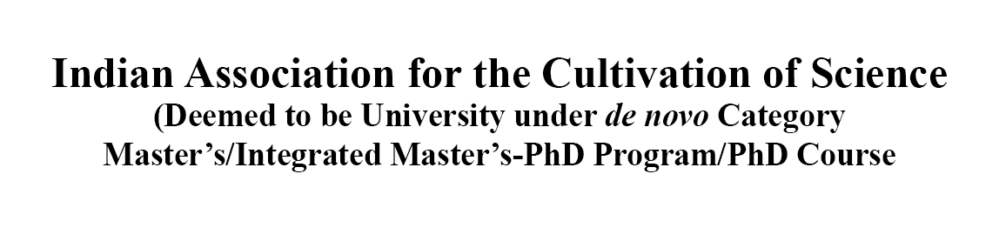

  

  

### What this account is all about

This is a group account for the 2020 Masters batch of the Indian Association for the Cultivation of Science (IACS) Computer Science Unit (CSU) to showcase their work as a group in several projects. This group comprises of three members - Avishek Lahiri (2020/SMCS/004), Sarthak Das (2018/UG/026) and Shubhajit Roy (2020/SMCS/003).

### Meet the members

1. **Avishek Lahiri** - Completed his Bachelors in Computer Science from Ramakrishna Mission Vidyamandira Belur in 2020. Presently pursuing his Integrated Masters-Ph.D Degree in Computer Science from IACS. Particularly interested in machine learning and natural language processing. You can visit his personal github account [here](https://github.com/AvishekLahiri).
2. **Sarthak Das** - Presently pursuing his Integrated Bachelors-Masters Degree in Computer Science from IACS. Particularly interested in logic and theoretical computer science. You can visit his personal github account [here](https://github.com/dassarthak18) and his personal gitlab account [here](https://gitlab.com/dassarthak18).
3. **Shubhajit Roy** - Completed his Bachelors in Mathematics from Presidency University Kolkata in 2020. Presently pursuing his Integrated Masters-Ph.D Degree in Computer Science from IACS. Particularly interested in graph theory and combinatorics. You can visit his personal github account [here](https://github.com/shubhajitroy123) and his personal gitlab account [here](https://gitlab.com/shubhajitroy123).
